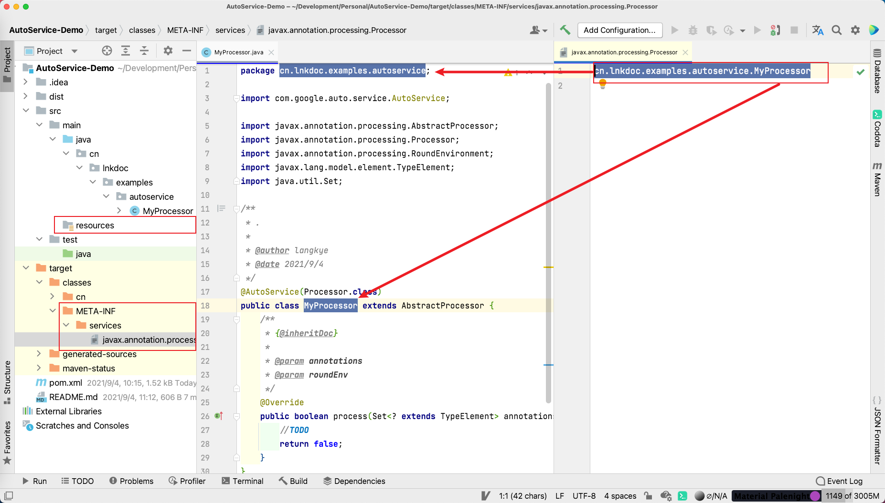
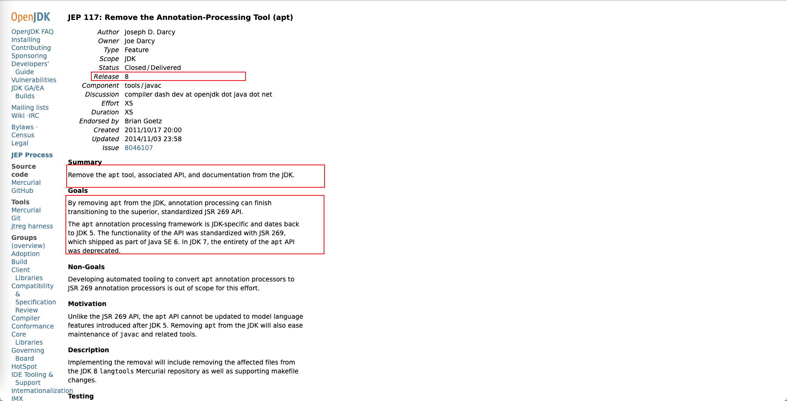

### What AutoService?
> 在使用自定义注解和注解处理器时，编写完后，会忘记创建注解处理器的描述文件，于是找到了`@AutoService`。
> 
> `@AutoService`是google为注解处理器提供的注解，其作用是编译时在`classpath`下生成注解处理器的描述文件。即，生成`Processor`实现类的描述文件（`META-INF/services/...`)
> 
> `[AutoService]`项目地址：https://github.com/google/auto/tree/master/service
> 
> [[`AutoService-Demo`]](https://github.com/langkye/AutoService-Demo) 示例
> 
> 例如：
> 



### 示例代码

- `pom.xml`
  ```xml
  <?xml version="1.0" encoding="UTF-8"?>
  <project xmlns="http://maven.apache.org/POM/4.0.0"
  xmlns:xsi="http://www.w3.org/2001/XMLSchema-instance"
  xsi:schemaLocation="http://maven.apache.org/POM/4.0.0 http://maven.apache.org/xsd/maven-4.0.0.xsd">
  <modelVersion>4.0.0</modelVersion>
  
      <groupId>cn.lnkdoc</groupId>
      <artifactId>AutoService-Demo</artifactId>
      <version>1.0.0</version>
  
      <properties>
          <maven.compiler.source>8</maven.compiler.source>
          <maven.compiler.target>8</maven.compiler.target>
          <auto-service.version>1.0</auto-service.version>
      </properties>
  
      <dependencies>
          <dependency>
              <groupId>com.google.auto.service</groupId>
              <artifactId>auto-service-annotations</artifactId>
              <version>${auto-service.version}</version>
          </dependency>
      </dependencies>
  
      <build>
          <plugins>
              <plugin>
                  <artifactId>maven-compiler-plugin</artifactId>
                  <version>3.8.1</version>
                  <configuration>
                      <annotationProcessorPaths>
                          <path>
                              <groupId>com.google.auto.service</groupId>
                              <artifactId>auto-service</artifactId>
                              <version>${auto-service.version}</version>
                          </path>
                      </annotationProcessorPaths>
                  </configuration>
              </plugin>
          </plugins>
      </build>
  
  </project>
  ```
- `MyProcessor.java`
  ```java
  package cn.lnkdoc.examples.autoservice;

  import com.google.auto.service.AutoService;
  import javax.annotation.processing.AbstractProcessor;
  import javax.annotation.processing.Processor;
  import javax.annotation.processing.RoundEnvironment;
  import javax.lang.model.element.TypeElement;
  import java.util.Set;

  /**
   * .
   *
   * @author langkye
   * @date 2021/9/4
   */
  @AutoService(Processor.class)
  public class MyProcessor extends AbstractProcessor {
      /**
       * {@inheritDoc}
       *
       * @param annotations
       * @param roundEnv
       */
      @Override
      public boolean process(Set<? extends TypeElement> annotations, RoundEnvironment roundEnv) {
          //TODO
          return false;
      }
  }
  ```

---
### 相关的技术
> SPI、[<del> [<code>APT</code>(Annotation-Processing Tool )](https://openjdk.java.net/jeps/117) </del>] 、[<code>JSR269</code>(Pluggable Annotation Processing API)]
。
> 
**注**：APT从`JDK1.8`起已经被移除（[JEP 117: Remove the Annotation-Processing Tool (apt)](http://openjdk.java.net/jeps/117) ）,转而使用标准化的`JSR269`API：


